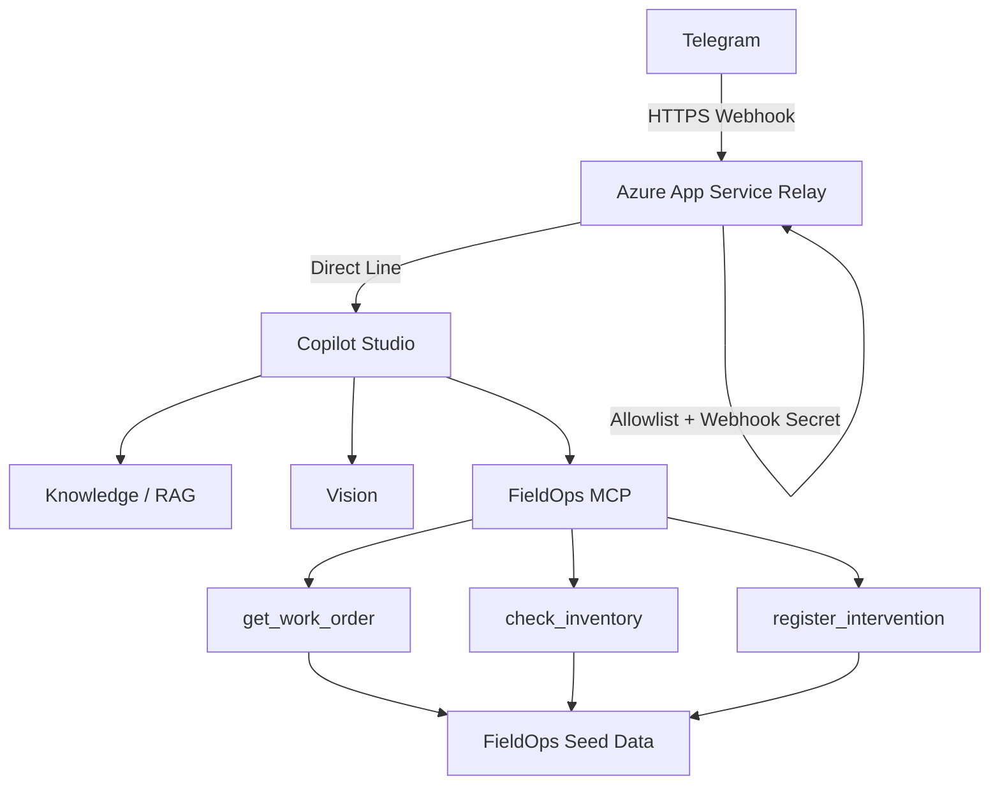

# FieldOps Assist

FieldOps Assist es una prueba de concepto de un agente de IA para soporte a técnicos de campo.

La solución integra Telegram, Azure App Service, Microsoft Copilot Studio, Model Context Protocol (MCP), recuperación de conocimiento técnico mediante RAG y análisis de fotografías.

El agente puede:

- Consultar órdenes de trabajo.
- Consultar inventario y compatibilidad de repuestos.
- Recuperar procedimientos desde documentación técnica.
- Analizar fotografías enviadas por técnicos.
- Mantener contexto conversacional.
- Registrar intervenciones únicamente después de una confirmación explícita.
- Prevenir registros duplicados mediante idempotencia.
- Generar trazabilidad mediante `correlation_id`.

---

## Arquitectura



Flujo principal:

```text
Telegram
    ↓
HTTPS Webhook
    ↓
Relay Node.js / TypeScript
    ↓
Direct Line
    ↓
Copilot Studio
    ├── RAG / Knowledge
    ├── Vision
    └── MCP
          ├── get_work_order
          ├── check_inventory
          └── register_intervention
```

---

## Componentes

### Relay Telegram

Ubicación:

```text
relay/
```

Responsabilidades:

- Recibir mensajes mediante Telegram Webhook.
- Validar `X-Telegram-Bot-Api-Secret-Token`.
- Aplicar allowlist de usuarios de Telegram.
- Procesar texto y fotografías.
- Descargar temporalmente fotografías.
- Mantener una sesión Direct Line por `chat_id`.
- Enviar mensajes y fotografías a Copilot Studio.
- Limpiar citas y formato antes de responder en Telegram.
- Generar logs estructurados.
- Generar un `correlation_id` por solicitud.

---

## MCP Server

Ubicación:

```text
mcp-server/
```

Implementado con:

- Node.js
- TypeScript
- Model Context Protocol SDK
- Streamable HTTP
- Zod
- Express

Herramientas disponibles:

### `get_work_order`

Consulta una orden de trabajo mediante:

```text
work_order_id
```

---

### `check_inventory`

Consulta disponibilidad y compatibilidad de un repuesto considerando:

```text
work_order_id
part_number
```

Distingue entre:

- Compatibilidad.
- Disponibilidad.
- Cantidad disponible.

---

### `register_intervention`

Permite registrar una intervención técnica.

Requiere:

```text
work_order_id
technician_id
action_summary
result
confirmed
idempotency_key
correlation_id
```

La operación está protegida mediante:

- Confirmación explícita.
- Validación de orden de trabajo.
- Validación de técnico.
- Validación de asignación.
- `idempotency_key`.
- Bloqueo serializado de escritura.
- Protección contra duplicados.

---

## Seguridad

### Telegram Webhook Secret

Telegram debe enviar:

```text
X-Telegram-Bot-Api-Secret-Token
```

Las solicitudes con un secret incorrecto reciben:

```text
HTTP 401
```

---

### Allowlist de Telegram

El Relay solo permite usuarios configurados en:

```env
TELEGRAM_ALLOWED_USER_IDS=
```

Se admiten múltiples IDs separados por coma:

```env
TELEGRAM_ALLOWED_USER_IDS=123456789,987654321
```

Los usuarios no autorizados son rechazados antes de llegar a Copilot Studio.

---

### Confirmación para escrituras

`register_intervention` nunca debe ejecutarse automáticamente.

El agente presenta primero un resumen:

```text
Resumen de intervención

Orden:
Técnico:
Acción:
Resultado:

¿Confirmas que deseas registrar esta intervención?
```

Solo una confirmación explícita permite ejecutar la escritura.

---

### Idempotencia

Cada intervención lógica nueva utiliza una nueva:

```text
idempotency_key
```

La misma clave únicamente debe reutilizarse para reintentar exactamente la misma operación después de un fallo técnico incierto.

Esto evita registros duplicados.

---

## Observabilidad

Cada mensaje genera un:

```text
correlation_id
```

Ejemplo:

```json
{
  "level": "INFO",
  "event": "telegram.message.received",
  "correlation_id": "..."
}
```

Eventos principales:

```text
relay.started

telegram.webhook.update_received

telegram.message.received

telegram.auth.denied

fieldops.inbound.normalized

telegram.photo.download.started

copilot.request.started

copilot.request.completed

telegram.message.completed

telegram.message.failed
```

Esto permite seguir una solicitud completa:

```text
Telegram
    ↓
Relay
    ↓
Direct Line
    ↓
Copilot
    ↓
Respuesta
```

utilizando el mismo `correlation_id`.

También se registra:

- `chat_id`
- `telegram_user_id`
- `message_id`
- `conversation_id`
- tipo de mensaje
- cantidad de respuestas
- duración de Copilot
- duración total

No se registran tokens ni secrets.

---

## Variables de entorno del Relay

Crear:

```text
relay/.env
```

basándose en:

```text
relay/.env.example
```

Variables:

```env
TELEGRAM_BOT_TOKEN=
COPILOT_TOKEN_ENDPOINT=
TELEGRAM_WEBHOOK_SECRET=
TELEGRAM_ALLOWED_USER_IDS=
```

El archivo `.env` está excluido de Git.

---

## Ejecutar Relay localmente

```powershell
cd relay
npm install
```

Desarrollo:

```powershell
npm run dev
```

Validación TypeScript:

```powershell
npm run typecheck
```

Build:

```powershell
npm run build
```

Producción:

```powershell
npm start
```

Health endpoint:

```text
GET /health
```

Ejemplo:

```json
{
  "status": "ok",
  "service": "fieldops-telegram-relay",
  "telegram": "webhook",
  "copilot": "direct-line",
  "vision": "enabled"
}
```

---

## Ejecutar MCP localmente

```powershell
cd mcp-server
npm install
npm run build
npm start
```

Health:

```text
http://localhost:3000/health
```

---

## Tests MCP

Con el MCP ejecutándose localmente:

```powershell
npm test
```

Cobertura smoke actual:

```text
health endpoint
MCP tool discovery
get_work_order
unknown work order
check_inventory
```

Resultado esperado:

```text
tests 5
pass 5
fail 0
```

---

## Knowledge / RAG

Copilot Studio utiliza documentación técnica específica de los equipos soportados.

Reglas principales:

- Identificar primero el modelo exacto.
- No mezclar códigos ni procedimientos entre modelos.
- Priorizar la documentación correspondiente al equipo de la OT.
- No inventar valores no respaldados por la documentación.
- Mantener restricciones y advertencias del fabricante.

---

## Vision

El técnico puede enviar una fotografía directamente por Telegram.

Flujo:

```text
Telegram Photo
      ↓
Relay
      ↓
Download temporal
      ↓
Direct Line Upload
      ↓
Copilot Vision
      ↓
Contexto + RAG + OT
      ↓
Respuesta Telegram
```

La fotografía se trata como evidencia.

El agente no debe asumir:

- Marca.
- Modelo.
- Texto ilegible.
- Valores.
- Componentes.
- Diagnósticos definitivos.

cuando no puedan determinarse con suficiente fiabilidad.

---

## Sesiones

El Relay mantiene:

```text
Map<chat_id, CopilotSession>
```

Cada chat dispone de su propia conversación Direct Line.

Comando:

```text
/reset
```

elimina la conversación actual y fuerza la creación de una nueva.

Para esta PoC las sesiones están en memoria y se pierden cuando el App Service reinicia.

---

## Despliegue

Los componentes principales están preparados para Azure App Service.

Relay:

```text
Node.js 22
npm start
```

El puerto utiliza:

```typescript
process.env.PORT
```

proporcionado por Azure.

MCP:

```text
Node.js
Streamable HTTP
```

con soporte para:

```env
FIELDOPS_DATA_DIR=
```

permitiendo separar la ubicación de los datos entre desarrollo local y Azure.

---

## Pruebas E2E realizadas

La PoC ha sido validada en los siguientes escenarios:

```text
Telegram → Relay → Copilot
Telegram → Relay → MCP
Telegram → Relay → RAG
Telegram → Relay → Vision
Telegram → Relay → Vision + RAG + contexto OT
Telegram → confirmación → register_intervention
Telegram → allowlist
Webhook Secret
Idempotencia
Correlation ID
```

---

## Limitaciones actuales

Esta implementación es una PoC.

Limitaciones conocidas:

- Sesiones Direct Line almacenadas únicamente en memoria.
- Persistencia operacional basada en archivos JSON.
- La allowlist se configura mediante variable de entorno.
- La documentación técnica disponible no cubre todos los modelos posibles.
- Los scripts de pruebas de Direct Line son pruebas manuales y no una suite E2E automatizada completa.
- Para producción se recomienda una base de datos y almacenamiento persistente.
- Para producción se recomienda integrar telemetría centralizada y alertas.

---

## Evolución recomendada

Para una implementación productiva:

```text
Azure Key Vault
Azure Application Insights
Azure SQL / Cosmos DB
Azure Blob Storage
Microsoft Entra ID
RBAC
Persistencia distribuida de sesiones
CI/CD
Tests E2E automatizados
Rate limiting
Rotación de secrets
```

---

## Estado

```text
MCP                     ✅
Telegram Webhook        ✅
Copilot Studio          ✅
RAG                     ✅
Vision                  ✅
Contexto conversacional ✅
Write Guard             ✅
Idempotencia            ✅
Allowlist               ✅
Observabilidad          ✅
Azure deployment        ✅
E2E                     ✅
```

FieldOps Assist se encuentra funcional como prueba de concepto end-to-end.